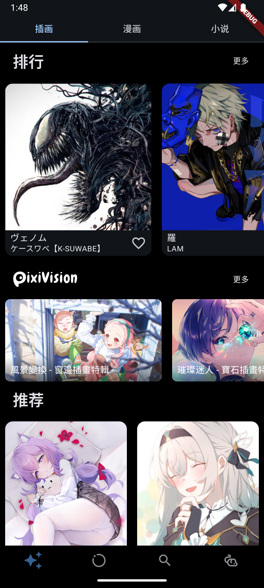
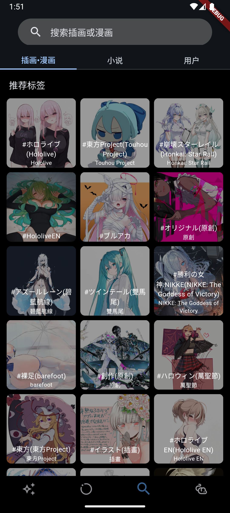

# SkanaPix

使用 Flutter 编写的 pixiv 第三方客户端。

Third-party pixiv flutter project client.

## 下载 Download
[Release](https://github.com/asdoll/skana_pix/releases)

## 预览 Prewview

| |  | 
|:-------------------:|:------------------------:|
| |  | 

## 简介 Introduction

 本项目为开源项目，使用完全免费。

 UI设计和model主要参考了[Pixez](https://github.com/Notsfsssf/pixez-flutter)的设计，部分参考了[Pixes](https://github.com/wgh136/pixes)。非常感谢他们的开源。
 
 至于小说阅读部分使用了[mabDc的eso](https://github.com/mabDc/eso)的api。
 
 这个app主要是为了解决看pixiv小说没办法横屏浏览的问题。作为主要用pixiv看小说的用户，参照了pixiv的官方app设计，把小说页面放到了首页。
 
 个人不喜欢侧边栏，不喜欢页面上太多的选项，所以功能上重新排布了。
 
 The project is open source and free to use.
 
 Main UI design referenced and models are referenced from Pixez. Some are referenced from Pixes. Really thanks for their teams.
 
 Also thanks for mabDc's project eso, provides a display of novel pages.
 
 As a Pixiv novel user, I refered swipe horizontal to read, so changed the view for novels.
 I also refered to Pixiv official app and make novel and manga pages all at main page, and did minor changes of layouts.